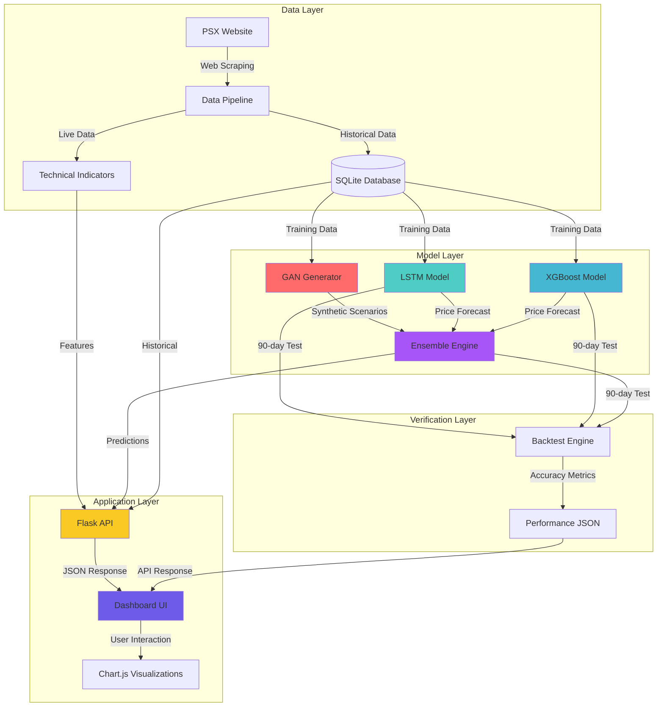

# AI Market Forecasting System
### Hybrid Ensemble Deep Learning Model for Pakistan Stock Exchange (PSX)


A sophisticated deep learning system that combines **GAN**, **LSTM**, and **XGBoost** models to predict stock market movements for the Pakistan Stock Exchange (PSX). Features real-time data pipeline, ensemble predictions, and an interactive web dashboard.

---

## 🎯 Features

- **Hybrid Ensemble Model**: Combines LSTM, XGBoost, and GAN for superior accuracy
- **Real-time Data Pipeline**: Scrapes live PSX data with automatic fallback mechanisms
- **Interactive Dashboard**: Beautiful Flask-based UI with Chart.js visualizations
- **Backtesting Engine**: 90-day historical performance validation
- **Technical Indicators**: RSI, SMA, EMA, Bollinger Bands integration
- **Model Persistence**: Trained models saved for instant inference
- **Professional Structure**: Organized codebase following Python best practices

---

## 🏗️ Architecture



---

## 🚀 Quick Start

### Prerequisites

- Python 3.9+
- Virtual environment (vanas)
- 2GB+ free disk space

### Installation

1. **Clone the repository**
   ```bash
   git clone https://github.com/YOUR_USERNAME/AI-MarketForecasting-Using-GAN-PSX-data.git
   cd AI-MarketForecasting-Using-GAN-PSX-data
   ```

2. **Create virtual environment**
   ```bash
   python -m venv vanas
   vanas\Scripts\activate  # Windows
   ```

3. **Install dependencies**
   ```bash
   pip install -r requirements.txt
   ```

4. **Train models** (Optional - pre-trained models included)
   - Open Jupyter notebooks in `notebooks/` folder
   - Run `GAN_MODEL/GAN.ipynb`
   - Run `LSTM_MODEL/LSTM_Train.ipynb`
   - Run `XGBOOST_MODEL/XGBoost_Train.ipynb`

---

## 🎮 Usage

### Option 1: Using Batch Scripts (Easiest)

Simply double-click the batch files:

- **`run_app.bat`** - Starts the Flask dashboard on http://127.0.0.1:5000
- **`run_backtest.bat`** - Runs the backtesting engine

### Option 2: Manual Commands

1. **Activate virtual environment**
   ```bash
   vanas\Scripts\activate
   ```

2. **Run the dashboard**
   ```bash
   python src\app.py
   ```

3. **Run backtesting**
   ```bash
   python src\backtest.py
   ```

4. **Access the dashboard**
   - Open browser: http://127.0.0.1:5000
   - View predictions, charts, and model performance

---

## 📁 Project Structure

```
AI-MarketForecasting-Using-GAN-PSX-data/
├── data/
│   ├── raw/                    # CSV data files
│   └── database/               # SQLite database (nexus.db)
│
├── models/
│   ├── saved_models/           # Trained models (.h5, .json)
│   └── scalers/                # Preprocessing scalers (.pkl)
│
├── results/                    # Performance metrics (JSON)
│
├── src/                        # Main application
│   ├── app.py                  # Flask web application
│   ├── models_engine.py        # Model loading and inference
│   ├── data_pipeline.py        # Data scraping and processing
│   ├── db_manager.py           # Database operations
│   └── backtest.py             # Backtesting engine
│
├── scripts/                    # Utility scripts
│   ├── export_to_csv.py        # Export DB to CSV
│   └── run_pipeline.py         # Data pipeline runner
│
├── notebooks/                  # Jupyter notebooks
│   ├── GAN_MODEL/              # GAN training
│   ├── LSTM_MODEL/             # LSTM training
│   └── XGBOOST_MODEL/          # XGBoost training
│
├── templates/                  # HTML templates
│   └── dashboard.html          # Main dashboard UI
│
├── run_app.bat                # Helper script for Flask
├── run_backtest.bat           # Helper script for backtest
├── requirements.txt           # Python dependencies
└── README.md                  # This file
```

---

## 🔬 Models & Techniques

### 1. **GAN (Generative Adversarial Network)**
- **Purpose**: Generate synthetic OHLCV market scenarios
- **Architecture**: Generator with Batch Normalization, Discriminator with Dropout
- **Output**: 30-day synthetic price sequences

### 2. **LSTM (Long Short-Term Memory)**
- **Purpose**: Time-series price forecasting
- **Architecture**: Bidirectional LSTM (100 units × 2 layers) with Dropout
- **Input**: 60-day lookback window
- **Accuracy**: ~59.3%

### 3. **XGBoost**
- **Purpose**: Feature-based regression
- **Features**: RSI, SMA_20, SMA_50, EMA_12, Close Price
- **Accuracy**: ~40.6%

### 4. **Ensemble Model**
- **Method**: Average of LSTM and XGBoost predictions
- **Purpose**: Reduce individual model variance
- **Accuracy**: ~49.9% (balanced performance)

---

## 🌐 API Endpoints

| Endpoint | Method | Description |
|----------|--------|-------------|
| `/` | GET | Main dashboard page |
| `/api/metrics` | GET | Real-time predictions and metrics |
| `/api/backtest` | GET | Historical model performance (90 days) |
| `/gan-model` | GET | GAN visualization page |

### Sample Response: `/api/metrics`
```json
{
  "current_price": 118.50,
  "rsi": 45.23,
  "predictions": {
    "lstm": 119.34,
    "xgboost": 118.92,
    "ensemble": 119.13
  },
  "chart_data": {
    "dates": ["2024-01-01", "2024-01-02", ...],
    "close": [118.5, 119.2, ...],
    "bb_upper": [125.3, ...],
    "bb_lower": [112.1, ...]
  }
}
```

---

## 🎨 Dashboard Features

- **Live Price Tracking**: Real-time PSX data updates
- **Technical Indicators**: RSI, Bollinger Bands visualization
- **Model Predictions**: Side-by-side comparison of LSTM, XGBoost, Ensemble
- **Interactive Charts**: Click model cards to view 90-day backtesting performance
- **Color-coded Accuracy**: Visual representation of model reliability

---

## 🧪 Backtesting

The system validates model performance using 90 days of historical data:

```bash
python src\backtest.py
```

**Output:**
- LSTM Accuracy: ~59.3%
- XGBoost Accuracy: ~40.6%
- Ensemble Accuracy: ~49.9%

Results saved to: `results/model_performance.json`

---

## 🛠️ Tech Stack

- **Backend**: Flask, SQLAlchemy
- **ML Frameworks**: TensorFlow/Keras, XGBoost, Scikit-learn
- **Data Processing**: Pandas, NumPy, TA-Lib
- **Web Scraping**: BeautifulSoup, Requests
- **Frontend**: HTML, CSS (Tailwind), JavaScript (Chart.js)
- **Database**: SQLite
- **Deployment**: Flask Development Server

---

## 📊 Data Sources

- **Primary**: Pakistan Stock Exchange (PSX) - https://dps.psx.com.pk
- **Fallback**: Yahoo Finance API
- **Ticker**: OGDC (Oil & Gas Development Company)

---

## 🤝 Contributing

Contributions are welcome! Please follow these steps:

1. Fork the repository
2. Create a feature branch (`git checkout -b feature/AmazingFeature`)
3. Commit your changes (`git commit -m 'Add AmazingFeature'`)
4. Push to the branch (`git push origin feature/AmazingFeature`)
5. Open a Pull Request

---

## 📝 License

This project is licensed under the MIT License - see the [LICENSE](LICENSE) file for details.

---

## 👨‍💻 Author

**Your Name**
- GitHub: [@yourusername](https://github.com/yourusername)
- LinkedIn: [Your LinkedIn](https://linkedin.com/in/yourprofile)

---

## 🙏 Acknowledgments

- Pakistan Stock Exchange for public data access
- TensorFlow and XGBoost communities
- Chart.js for beautiful visualizations

---

## ⚠️ Disclaimer

This system is for **educational and research purposes only**. Stock market predictions are inherently uncertain. **Do not** use this system for actual trading decisions without proper financial advice. Past performance does not guarantee future results.

---

## 📞 Support

For issues, questions, or suggestions:
- Open an issue on GitHub
- Email: your.email@example.com

---

**⭐ Star this repository if you find it helpful!**
