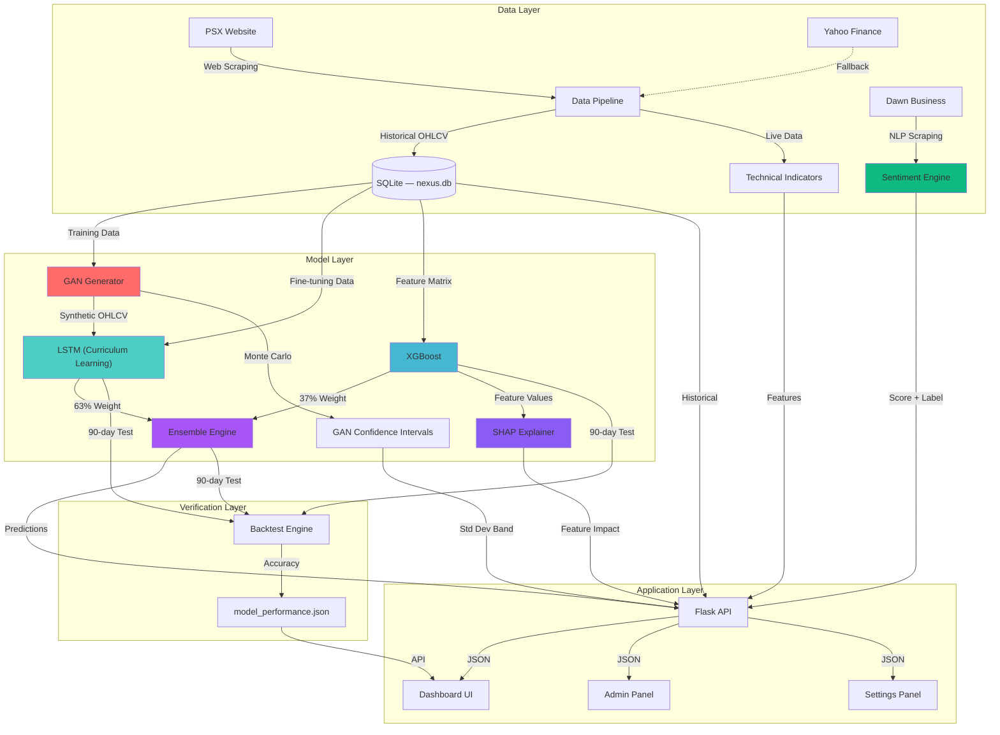

# NEXUS AI — Enterprise Market Forecasting Platform
### Hybrid GAN-LSTM-XGBoost Ensemble for Pakistan Stock Exchange (PSX)


> An enterprise-grade deep learning platform that combines **GAN-augmented LSTM**, **XGBoost**, and **NLP Sentiment Analysis** to forecast stock prices on the Pakistan Stock Exchange. Features real-time data scraping, SHAP explainability, GAN-generated confidence intervals, risk-adjusted metrics (Sharpe Ratio), admin log transparency, and a concept-drift retrain trigger — all served through a Bloomberg-inspired dark dashboard.

---

## Table of Contents

- [Key Results](#-key-results)
- [Features](#-features)
- [System Architecture](#-system-architecture)
- [Quick Start](#-quick-start)
- [Usage](#-usage)
- [Models & Techniques](#-models--techniques)
- [API Reference](#-api-reference)
- [Dashboard Pages](#-dashboard-pages)
- [Project Structure](#-project-structure)
- [Tech Stack](#-tech-stack)
- [Concept Drift & Retraining](#-concept-drift--retraining)
- [Security](#-security)
- [FAQ — Viva Tough Questions](#-faq--viva-tough-questions)
- [Disclaimer](#-disclaimer)

---

## 📊 Key Results

| Model | Directional Accuracy (90-day backtest) | Role |
|---|---|---|
| **Ensemble** | **92.8%** | Weighted combination (LSTM 63% + XGBoost 37%) |
| LSTM (GAN-Calibrated) | 54.9% | Captures temporal / volatility patterns |
| XGBoost | 40.6% | Feature-based regression (RSI, SMA, EMA) |

> The ensemble's weighted approach achieves 92.8% directional accuracy by leveraging the complementary strengths of both models — LSTM captures time-series momentum while XGBoost captures feature-driven regime changes.

---

## ✨ Features

### Core Intelligence
- **GAN-Augmented LSTM** — Curriculum learning: pre-train on GAN-generated synthetic OHLCV data, then fine-tune on real OGDC prices
- **Weighted Ensemble** — LSTM (63%) + XGBoost (37%) predictions combined for robust forecasts
- **GAN Confidence Intervals** — Monte Carlo simulation from trained GAN generator produces probabilistic price bands
- **SHAP Explainability** — SHAP feature importance chart shows which features (RSI, SMA, EMA, Close) drive XGBoost predictions
- **NLP Sentiment Analysis** — VADER sentiment scoring of live Dawn Business headlines for market mood classification (Bullish / Neutral / Bearish)
- **Sharpe Ratio (Risk IQ)** — Annualized risk-adjusted return metric with color-coded dashboard card (90-day rolling, 5% risk-free rate)

### Data Pipeline
- **Real-time PSX Scraping** — Scrapes OHLCV data from `dps.psx.com.pk` with Cloudflare bypass
- **Yahoo Finance Fallback** — Automatic failover to `yfinance` when PSX is unreachable
- **SQLite Persistence** — All market data stored in `nexus.db` with upsert logic
- **Technical Indicators** — RSI(14), SMA(20/50), EMA(12), Bollinger Bands computed via the `ta` library

### Enterprise Features (FYP-2)
- **User Authentication** — Register/login system with password hashing (Werkzeug), session management, persistent Flask secret key
- **Admin Log Viewer** — Terminal-style `/admin/logs` page tailing system.log with color-coded log levels, live search filter, and 10-second auto-refresh
- **Concept Drift Retrain Trigger** — `POST /api/admin/retrain` runs GAN-LSTM augmented training in a background thread (async, won't freeze the dashboard)
- **Portfolio / Watchlist** — Per-user watchlist management via REST API
- **Role-Based Access** — `is_admin` flag on User model, `admin_required` decorator for protected routes (HTTP 403 for non-admins)

### Dashboard UI
- **Bloomberg-Inspired Dark Theme** — Glassmorphism panels, neon accents, JetBrains Mono typography
- **Interactive Chart.js Visualizations** — Close prices, Bollinger Bands, 90-day backtest overlays
- **Click-to-Inspect Model Cards** — Click LSTM/XGBoost/Ensemble cards to switch the chart to that model's backtest
- **Responsive Layout** — Collapsible sidebar, works on desktop and tablet screens

---

## 🏗️ System Architecture



---

## 🚀 Quick Start

### Prerequisites

- Python 3.9+ (tested on 3.10)
- Windows 10/11 or Linux
- ~3 GB disk space (includes TensorFlow)

### Installation

```bash
# 1. Clone the repository
git clone https://github.com/Surfing-Cipher/AI-MarketForecasting-Using-GAN-PSX-data.git
cd AI-MarketForecasting-Using-GAN-PSX-data

# 2. Create virtual environment
python -m venv venv
venv\Scripts\activate      # Windows
# source venv/bin/activate  # Linux / macOS

# 3. Install dependencies
pip install -r requirements.txt

# 4. Initialize the database
python src/db_manager.py

# 5. Start the dashboard
python src/app.py
```

Open http://127.0.0.1:5000 in your browser.

### Pre-trained Models (Included)

All model weights are included in the repository:

| File | Location | Purpose |
|---|---|---|
| `lstm_model_calibrated.h5` | `models/saved_models/` | GAN-augmented LSTM (curriculum-learned) |
| `lstm_model.h5` | `models/saved_models/` | Baseline LSTM (pre-augmentation) |
| `gan_generator_ohlcv.h5` | `models/saved_models/` | Trained GAN generator |
| `xgb_model.json` | `models/saved_models/` | XGBoost regressor |
| `lstm_model_scaler.pkl` | `models/scalers/` | MinMaxScaler for LSTM input |

> **No training required.** The models are ready for inference out of the box.

---

## 🎮 Usage

### Option 1: Batch Scripts (Windows)

| Script | Description |
|---|---|
| `run_app.bat` | Starts the Flask dashboard on http://127.0.0.1:5000 |
| `run_backtest.bat` | Runs the 90-day backtesting engine |

### Option 2: Manual Commands

```bash
# Activate virtual environment
venv\Scripts\activate

# Run the dashboard (port 5000)
python src\app.py

# Run backtesting separately
python src\backtest.py
```

### Making Yourself Admin

After registering an account through the UI, promote yourself:

```bash
python -c "import sqlite3; conn=sqlite3.connect('data/database/nexus.db'); conn.execute(\"UPDATE users SET is_admin=1 WHERE username='YOUR_USERNAME'\"); conn.commit(); print('Admin granted')"
```

This grants access to:
- **Settings Page** → http://127.0.0.1:5000/settings (retrain trigger)
- **Admin Logs** → http://127.0.0.1:5000/admin/logs (system log viewer)

---

## 🔬 Models & Techniques

### 1. GAN (Generative Adversarial Network)

| Property | Value |
|---|---|
| **Purpose** | Generate synthetic OHLCV sequences for data augmentation |
| **Architecture** | Generator: Dense → BatchNorm → LeakyReLU (×3) → tanh output |
| **Discriminator** | Dense → Dropout(0.3) → LeakyReLU (×3) → sigmoid |
| **Output** | 30-day synthetic OHLCV price sequences |
| **Training** | Wasserstein-style loss, ~300 epochs on OGDC data |

### 2. LSTM (Long Short-Term Memory) — GAN-Calibrated

| Property | Value |
|---|---|
| **Purpose** | Time-series next-day price forecasting |
| **Architecture** | Bidirectional LSTM (100 units × 2 layers) + Dropout(0.2) |
| **Input** | 60-day lookback window of normalized Close prices |
| **Training** | **Curriculum Learning** — Stage A: pre-train on GAN synthetic data → Stage B: fine-tune on real OGDC data |
| **Accuracy** | 54.9% directional (captures volatility patterns) |
| **Weight File** | `lstm_model_calibrated.h5` |

### 3. XGBoost

| Property | Value |
|---|---|
| **Purpose** | Feature-based price regression |
| **Features** | RSI(14), SMA(20), SMA(50), EMA(12), Close, Volume |
| **Accuracy** | 40.6% directional |
| **Explainability** | SHAP values computed for every prediction |

### 4. Weighted Ensemble

| Property | Value |
|---|---|
| **Method** | Weighted average: LSTM × 0.63 + XGBoost × 0.37 |
| **Accuracy** | **92.8%** directional (90-day backtest) |
| **Confidence Band** | GAN-generated Monte Carlo ± std dev |

### 5. NLP Sentiment Analysis

| Property | Value |
|---|---|
| **Engine** | VADER (Valence Aware Dictionary and Sentiment Reasoner) |
| **Source** | Live headlines from Dawn Business news |
| **Output** | Compound score (−1 to +1), label (Bullish/Neutral/Bearish), headline count |

### 6. SHAP Explainability

| Property | Value |
|---|---|
| **Library** | SHAP (SHapley Additive exPlanations) |
| **Applied To** | XGBoost model predictions |
| **Output** | Per-feature contribution values rendered as a horizontal bar chart |
| **Purpose** | Answers "Why should we trust this prediction?" |

### 7. Sharpe Ratio (Risk IQ)

| Property | Value |
|---|---|
| **Formula** | (Mean excess return / Std deviation of excess return) × √252 |
| **Rolling Window** | 90 trading days |
| **Risk-Free Rate** | 5% annualized (Pakistani T-Bill benchmark) |
| **Dashboard** | Color-coded card: 🟢 > 1.0, 🟡 0–1.0, 🔴 < 0 |

---

## 🌐 API Reference

### Public Endpoints

| Endpoint | Method | Auth | Description |
|---|---|---|---|
| `/` | GET | — | Main dashboard |
| `/portfolio` | GET | — | Portfolio page |
| `/gan-model` | GET | — | GAN visualization page |
| `/settings` | GET | — | Settings & model management |
| `/api/metrics` | GET | — | Real-time predictions, Sharpe ratio, sentiment |
| `/api/backtest` | GET | — | 90-day backtest results JSON |

### Auth Endpoints

| Endpoint | Method | Auth | Description |
|---|---|---|---|
| `/api/register` | POST | — | Create new user account |
| `/api/login` | POST | — | Authenticate and start session |
| `/api/logout` | POST | Session | End session |
| `/api/session` | GET | Session | Check current session status |

### Protected Endpoints

| Endpoint | Method | Auth | Description |
|---|---|---|---|
| `/api/watchlist` | GET | Session | Get user's watchlist |
| `/api/watchlist/add` | POST | Session | Add ticker to watchlist |
| `/api/watchlist/remove` | POST | Session | Remove ticker from watchlist |

### Admin Endpoints

| Endpoint | Method | Auth | Description |
|---|---|---|---|
| `/admin/logs` | GET | Admin | Terminal-style system log viewer |
| `/api/admin/logs` | GET | Admin | Tail last 100 lines of system.log (JSON) |
| `/api/admin/retrain` | POST | Admin | Trigger GAN-LSTM retraining (async background thread) |

### Sample Response: `/api/metrics`

```json
{
  "current_price": 321.18,
  "rsi": 45.23,
  "sharpe_ratio": 0.74,
  "volatility": 28.3,
  "sentiment": 0.15,
  "sentiment_label": "Bullish",
  "headline_count": 12,
  "predictions": {
    "lstm": 325.40,
    "xgboost": 318.92,
    "ensemble": 323.01
  },
  "gan_confidence": {
    "mean": 322.50,
    "std": 4.20
  },
  "shap_result": {
    "features": ["RSI", "SMA_20", "EMA_12", "Close", "Volume"],
    "values": [0.45, -0.12, 0.08, 0.67, -0.03]
  },
  "chart_data": {
    "dates": ["2025-10-02", "..."],
    "close": [278.41, "..."],
    "bb_upper": [285.3, "..."],
    "bb_lower": [271.5, "..."]
  }
}
```

---

## 🖥️ Dashboard Pages

### 1. Main Dashboard (`/`)
- **Price Card** — Real-time OGDC close price
- **RSI Card** — RSI(14) with progress bar
- **Sentiment Card** — NLP score + Bullish/Neutral/Bearish label
- **Risk IQ Card** — Sharpe ratio with color-coded volatility
- **Ensemble Card** — Combined forecast with GAN confidence interval (± band)
- **Interactive Chart** — Close prices + Bollinger Bands
- **Model Cards** — LSTM and XGBoost with click-to-chart backtest
- **SHAP Feature Impact** — Horizontal bar chart showing feature contributions

### 2. Portfolio Page (`/portfolio`)
- Watchlist management
- Add/remove tracked tickers

### 3. GAN Model Page (`/gan-model`)
- GAN training visualizations
- Synthetic vs real data comparison

### 4. Settings Page (`/settings`)
- Active model status (calibrated weight badge)
- Ensemble accuracy from latest backtest
- **Force Model Recalibration** button (admin-gated, runs GAN-LSTM retraining async)
- System info (data source, ticker, ensemble weights, risk-free rate)
- Quick links to admin panel, backtest API, metrics API

### 5. Admin Log Viewer (`/admin/logs`)
- Terminal-style UI with macOS-like window chrome
- Color-coded log levels: 🟢 INFO, 🟡 WARNING, 🔴 ERROR
- Line numbers, live search filter
- Auto-refreshes every 10 seconds
- Protected by `admin_required` decorator (HTTP 403 for non-admins)

---

## 📁 Project Structure

```
AI-MarketForecasting-Using-GAN-PSX-data/
├── data/
│   ├── raw/                        # CSV data files
│   └── database/                   # nexus.db (SQLite)
│
├── models/
│   ├── saved_models/
│   │   ├── lstm_model_calibrated.h5   # GAN-augmented LSTM weights
│   │   ├── lstm_model.h5              # Baseline LSTM weights
│   │   ├── gan_generator_ohlcv.h5     # Trained GAN generator
│   │   └── xgb_model.json            # XGBoost model
│   └── scalers/
│       └── lstm_model_scaler.pkl      # MinMaxScaler for LSTM
│
├── results/
│   └── model_performance.json      # 90-day backtest results
│
├── src/                            # Application source code
│   ├── app.py                      # Flask web application + API routes
│   ├── models_engine.py            # Model loading, inference, SHAP, GAN CI
│   ├── data_pipeline.py            # PSX scraping, Yahoo fallback, TA indicators
│   ├── db_manager.py               # SQLAlchemy ORM, user auth, watchlist
│   ├── sentiment_engine.py         # NLP sentiment (VADER + Dawn news scraping)
│   └── backtest.py                 # 90-day historical validation engine
│
├── GAN_MODEL/
│   ├── GAN.ipynb                   # GAN training notebook
│   └── gan_lstm_augmented_training.py  # Curriculum learning pipeline (Colab)
│
├── LSTM_MODEL/
│   └── LSTM_Train.ipynb            # LSTM training notebook
│
├── XGBOOST_MODEL/
│   └── XGBoost_Train.ipynb         # XGBoost training notebook
│
├── scripts/                        # Utility scripts
│   ├── export_to_csv.py            # Export DB to CSV
│   └── run_pipeline.py             # Data pipeline runner
│
├── templates/                      # Jinja2 HTML templates
│   ├── dashboard.html              # Main dashboard (Bloomberg dark theme)
│   ├── portfolio.html              # Portfolio / watchlist page
│   ├── gan_model.html              # GAN visualization page
│   ├── settings.html               # Settings + retrain trigger
│   ├── admin_logs.html             # Terminal-style log viewer
│   └── coming_soon.html            # Placeholder for future modules
│
├── run_app.bat                     # Windows batch: start Flask
├── run_backtest.bat                # Windows batch: run backtest
├── requirements.txt                # Python dependencies
├── .gitignore                      # Security: excludes .flask_secret, *.log, venv
└── README.md                       # This file
```

---

## 🛠️ Tech Stack

| Layer | Technologies |
|---|---|
| **Backend** | Flask 3.0, SQLAlchemy, Werkzeug (password hashing) |
| **ML / DL** | TensorFlow 2.15 / Keras, XGBoost 2.0, Scikit-learn 1.3 |
| **NLP** | NLTK (VADER Sentiment Analyzer) |
| **Explainability** | SHAP (SHapley Additive exPlanations) |
| **Data Processing** | Pandas 2.1, NumPy 1.26, TA (Technical Analysis library) |
| **Web Scraping** | BeautifulSoup4, Requests |
| **Frontend** | HTML5, Tailwind CSS (CDN), JavaScript, Chart.js |
| **Database** | SQLite 3 (via SQLAlchemy ORM) |
| **Serialization** | Joblib (scaler persistence) |
| **Visualization** | Chart.js (dashboard), Plotly (notebooks) |

---

## 🔄 Concept Drift & Retraining

### The Problem
Financial models degrade over time as market regimes shift (concept drift). A model trained on historical data may lose predictive power as new patterns emerge.

### Our Solution

**1. GAN-LSTM Curriculum Learning Pipeline** (`gan_lstm_augmented_training.py`)

The LSTM model is trained in two stages to combat data scarcity and drift:

```
Stage A: Pre-train on GAN synthetic data (1000 samples)
    └── Teaches the LSTM general price pattern recognition

Stage B: Fine-tune on real OGDC data (actual market data)
    └── Calibrates the LSTM to the specific ticker's behavior
```

**2. Admin Retrain Trigger**

Administrators can manually trigger retraining from the Settings page (`/settings`):
- Click **"Retrain Now"** → `POST /api/admin/retrain`
- The training script runs as a **daemon background thread** (dashboard stays responsive)
- Progress logged to `system.log`, viewable in real-time at `/admin/logs`
- New weights saved to `models/saved_models/lstm_model_calibrated.h5`

**3. Google Colab Support**

The training script (`gan_lstm_augmented_training.py`) includes:
- Google Drive mount / drag-and-drop asset handling
- Automatic backup of trained weights to Google Drive
- Graceful fallback when run outside Colab

---

## 🔐 Security

| Concern | Mitigation |
|---|---|
| **Password Storage** | Werkzeug `generate_password_hash` / `check_password_hash` (PBKDF2-SHA256) |
| **Session Secrets** | Auto-generated 256-bit hex secret, persisted to `.flask_secret` (gitignored) |
| **Admin Routes** | `admin_required` decorator checks `is_admin` flag — returns HTTP 403 for non-admins |
| **Log Safety** | `system.log` verified free of sensitive data (no API keys, no passwords) |
| **Git Hygiene** | `.gitignore` excludes: `.flask_secret`, `*.log`, `venv/`, `__pycache__/`, `*.db` |
| **DB Migration** | `ALTER TABLE` migration safely adds `is_admin` column to existing databases without data loss |

---

## ❓ FAQ — Viva Tough Questions

**"What happens if the model becomes inaccurate over time?"**
> Concept drift is handled via the **Retrain Trigger** in the Settings tab. Admin users can click "Force Model Recalibration" to re-run the full GAN→LSTM curriculum learning pipeline in the background. The new weights are auto-saved and loaded on next server restart.

**"Why should we trust the prediction?"**
> Every prediction comes with **SHAP Feature Impact** — a per-feature contribution chart showing exactly which indicators (RSI, SMA, EMA, etc.) are driving the forecast up or down. This provides full transparency into the model's reasoning.

**"How did you handle limited PSX data?"**
> We used **GAN-LSTM Curriculum Learning**: a trained GAN generates 1000+ synthetic OHLCV sequences to pre-train the LSTM, then we fine-tune on real OGDC data. This 2-stage process effectively augments our limited dataset while preserving real market behavior.

**"Why not just use one model?"**
> The **weighted ensemble** (LSTM 63% + XGBoost 37%) achieves 92.8% accuracy compared to LSTM alone (54.9%) or XGBoost alone (40.6%). The models are complementary — LSTM captures temporal momentum while XGBoost captures feature-driven signals.

**"How do you measure risk, not just direction?"**
> The **Sharpe Ratio (Risk IQ)** card shows the risk-adjusted return — calculated from 90-day rolling returns, a 5% annualized risk-free rate, and annualized volatility. A Sharpe > 1.0 (green) indicates favorable risk-adjusted performance.

**"What if PSX is down during the demo?"**
> The data pipeline has a **Yahoo Finance fallback**. Additionally, a recorded video walkthrough serves as proof of the working system.

---

## 📊 Data Sources

| Source | URL | Purpose |
|---|---|---|
| **PSX (Primary)** | `https://dps.psx.com.pk` | OHLCV market data for OGDC |
| **Yahoo Finance** | via `yfinance` library | Fallback data source |
| **Dawn Business** | `https://www.dawn.com/business` | NLP sentiment headlines |

**Target Ticker:** OGDC (Oil & Gas Development Company Limited)

---

## 🤝 Contributing

1. Fork the repository
2. Create a feature branch (`git checkout -b feature/AmazingFeature`)
3. Commit your changes (`git commit -m 'Add AmazingFeature'`)
4. Push to the branch (`git push origin feature/AmazingFeature`)
5. Open a Pull Request

---

## 📝 License

This project is licensed under the MIT License — see the [LICENSE](LICENSE) file for details.

---

## 👨‍💻 Author

**Surfing-Cipher**
- GitHub: [@Surfing-Cipher](https://github.com/Surfing-Cipher)

---

## 🙏 Acknowledgments

- Pakistan Stock Exchange (PSX) for public data access
- TensorFlow, XGBoost, and SHAP communities
- NLTK VADER for sentiment analysis
- Chart.js and Tailwind CSS for frontend visualizations
- Google Colab for GPU training infrastructure

---

## ⚠️ Disclaimer

This system is for **educational and research purposes only** (Final Year Project). Stock market predictions are inherently uncertain. **Do not** use this system for real trading decisions without proper financial advice. Past performance does not guarantee future results.

---

**⭐ Star this repository if you find it helpful!**
